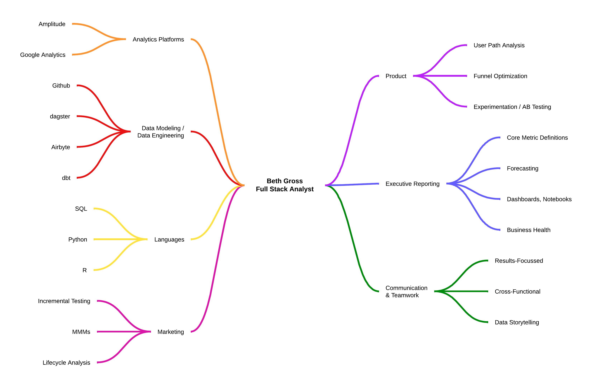

## Hello, I'm Beth

Complicated problems are my favorite kind. I like breaking them down, untangling messy data, and turning it into clear stories that spark action. I’ve built analytics foundations end-to-end — pipelines, models, experiments, dashboards. My sweet spot is digital product and growth analytics, where I get to connect numbers with business outcomes (and have some fun in the process).

Me, in a nutshell:  

## Portfolio

I’m in the process of adding more public projects here. For now, a few highlights:

### Developing Intuition
I like to dig into the nuts and bolts of processes, algorithms, and problems with the goal of making them intuitive and clear.  

#### Examples
* [Fitting Linear Regressions](https://github.com/bethgross/developing-intuition/blob/a3547bd2b87d227418e788c42805d22cd605ef81/linear_regression.ipynb)
* [Building a website using Hugo (without a theme)](https://github.com/bethgross/my-hugo-site)

## Beyond Data

Outside of analytics, I:  
- Freedive, swim, and paddleboard  
- Carve wooden spoons and love to cook  
- Hike and explore new places  
- Tinker and learn new things (currently: acoustic guitar)  
- Read, recharge, and watch SailGP and tennis  

## Thanks for stopping by — let’s connect!
[linkedin](https://www.linkedin.com/in/bethcgross/)

<!--
**bethgross/BethGross** is a ✨ _special_ ✨ repository because its `README.md` (this file) appears on your GitHub profile.

Here are some ideas to get you started:

- 🔭 I’m currently working on ...
- 🌱 I’m currently learning ...
- 👯 I’m looking to collaborate on ...
- 🤔 I’m looking for help with ...
- 💬 Ask me about ...
- 📫 How to reach me: ...
- 😄 Pronouns: ...
- ⚡ Fun fact: ...
-->
